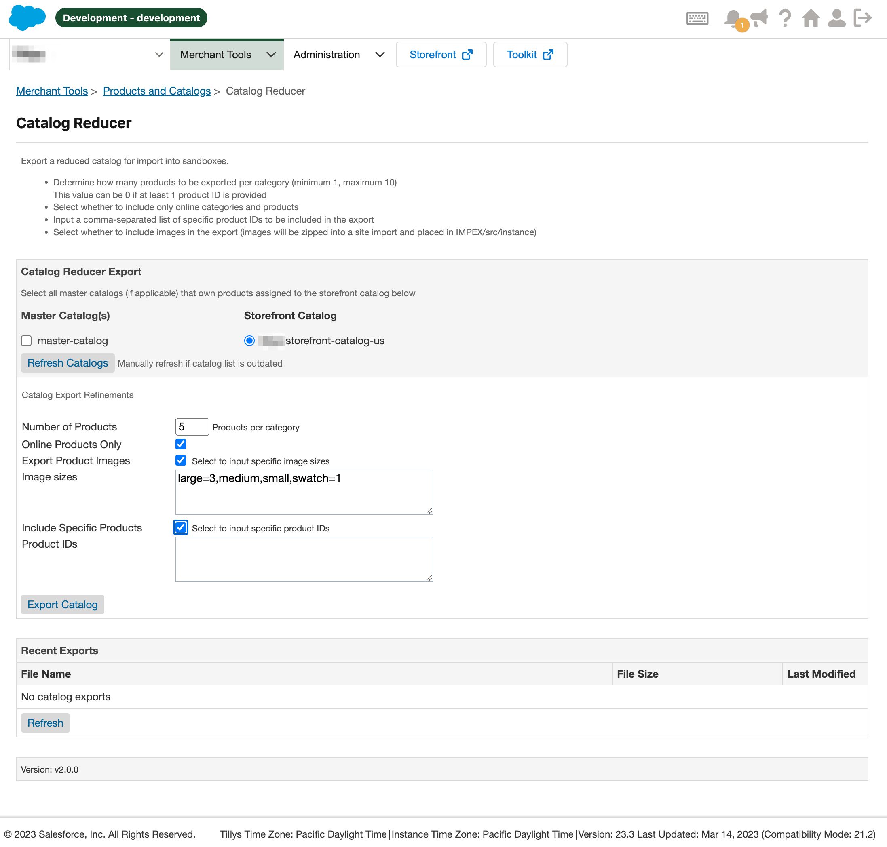

Catalog Reducer
===

> A business manager module to help with creating reduced catalogs for import into sandboxs,
> but still reflect the overall category structure of the standard catalog.

### FYI!
This continuation of the project created [here](https://github.com/z1haze/catalog-reducer-extension). I removed the fork because
salesforce likes to remove you from the org for inactivity and then delete any of your forks in the process. This repository
should be used from this day forward.

## Features

- [X] Create a reduced sized catalog in the format of a site import archive
- [X] Option to create a storefront catalog using multiple master catalogs
- [X] Option to include only online categories and products
- [X] Option to limit the number of products that will be included in each category
- [X] Option to include specific (must-have) product ID's
- [X] Option to include images for the products being exported while specifying
the maximum number of images per image type that will be exported
- [X] Option to include pricebooks for the generated reduced catalog
- [X] Option to include inventory-list for the generated catalog
- [X] Track current job progress in realtime
- [X] List files currently in IMPEX/src/instance for easy remote site imports

Installation
---

1. Download the latest release zip
2. Extract to your project
3. Import metadata from `sfcc-catalog-reducer/metadata`
4. Add `bm_catalogreducer` to both your BM and Site cartridge path
5. Go to `Administration` -> `Organization` -> `Roles & Permissions`
6. Click on the role you wish to use the catalog reducer with (likely Administrator for sandboxes)
7. Click on the `Business Manager Modules` tab
8. In the context dialog, select your sites, and proceed to enable
(clicking the checkbox) for the catalog reducer for each.

> Once configured, you should be able to access the catalog reducer via `Merchant Tools` -> `Products & Catalogs` -> `Catalog Reducer`

This project was originated from [here](https://github.com/SalesforceCommerceCloud/sfcc-catalog-reducer). These folks
laid the groundwork that made all of this possible. This update makes some changes for simplicity, but most notably
adds support for handling catalogs of large sizes where the export would be larger than 20k products in total. There are
some additional tweaks make to how images are exported so that you may choose to only export up to a certain number of images per product.
